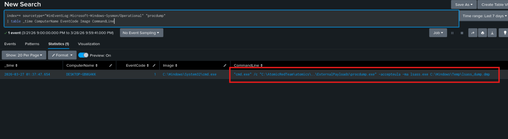
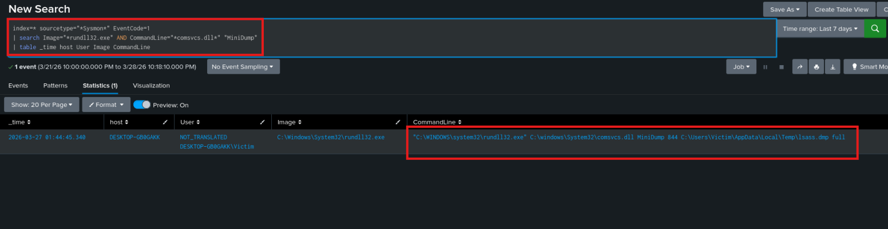

# LSASS Memory Dumping (T1003.001)

**MITRE Tactic:** Credential Access  
**MITRE Technique:** T1003.001 - OS Credential Dumping: LSASS Memory  
**Platform:** Windows  
**Sigma Rule:** [lsass_memory_dump_comsvcs.yml](../rules/windows/credential_access/lsass_memory_dump_comsvcs.yml)  
**Date:** 2026-03  
**Status:** Lab Validated ✅  

---

## Technique Overview

LSASS (Local Security Authority Subsystem Service) holds plaintext credentials, NTLM hashes, and Kerberos tickets in memory for active sessions. Attackers who dump this process gain immediate access to every credential cached on the machine — a single successful dump can enable lateral movement across an entire domain.

Two approaches were tested: an external signed binary (procdump.exe) and a living-off-the-land method using only binaries native to Windows. The LotL method is significantly higher fidelity as a detection target because it evades signature-based AV while still producing distinctive behavioral telemetry.

---

## Lab Setup

- **Host:** Windows 10 VM (DESKTOP-GB0GAKK)
- **User:** Simulated victim account
- **Logging:** Sysmon (EventCode=1 process creation)
- **Ingestion:** Splunk Universal Forwarder → Splunk (Ubuntu indexer)
- **Simulation:** Atomic Red Team T1003.001
- **Troubleshooting:** inputs.conf path corrected; 3-hour UTC clock drift resolved to restore real-time log visibility

---

## Test Case A: External Binary (Procdump)

**Objective:** Simulate an attacker using a signed Microsoft tool to dump LSASS memory.

**Execution:**
```powershell
Invoke-AtomicTest T1003.001 -TestNumbers 1
```

**Observation:** Sysmon captured procdump.exe execution with `-ma lsass.exe` arguments immediately.

**Detection Logic (SPL):**
index=* sourcetype="Sysmon" EventCode=1
| search Image="procdump.exe" AND CommandLine="-ma*"
| table _time, host, User, Image, CommandLine

**Result:** Alert fired immediately on binary name and command-line arguments.



---

## Test Case B: Living off the Land (LotL) — Higher Fidelity

**Objective:** Simulate a stealthy attacker using only native Windows binaries to avoid signature-based detection.

**Execution:**
"C:\Windows\System32\rundll32.exe" C:\Windows\System32\comsvcs.dll MiniDump 844 C:\Users\Victim\AppData\Local\Temp\lsass.dmp full

**Observation:** No new `.exe` was introduced. The attack executed entirely within the legitimate rundll32.exe process. Sysmon EventCode=1 captured the full command line.

**Telemetry Captured:**
Image:       C:\Windows\System32\rundll32.exe
CommandLine: "C:\WINDOWS\system32\rundll32.exe" C:\windows\System32\comsvcs.dll MiniDump 844 C:\Users\Victim\AppData\Local\Temp\lsass.dmp full
User:        DESKTOP-GB0GAKK\Victim
Host:        DESKTOP-GB0GAKK

**Detection Logic (SPL):**
index=* sourcetype="Sysmon" EventCode=1
| search Image="*rundll32.exe" AND CommandLine="comsvcs.dll" "MiniDump"
| table _time, host, User, Image, CommandLine

**Result:** Behavioral detection caught the attack where traditional AV would have remained silent.



---

## Detection Logic Explained

The Sigma rule targets the conjunction of two fields:

- `Image` ending in `rundll32.exe` — the LOLBin carrier
- `CommandLine` containing both `comsvcs.dll` AND `MiniDump`

Either string alone could appear in legitimate contexts. Together they represent a highly specific behavioral signature with near-zero false positive rate in standard environments. The `contains|all` modifier enforces that both conditions must be present in the same process creation event.

---

## False Positive Analysis

Legitimate use of comsvcs.dll MiniDump targeting LSASS is not a standard administrative operation. In production environments this rule should fire at critical severity with immediate triage required. Tuning would focus on approved memory diagnostic tools in specific maintenance windows, not on relaxing the core logic.

---

## Key Takeaway

The LotL method (Case B) is the higher-fidelity detection. Procdump is easily caught by AV and is a known tool. An attacker with any operational awareness will avoid it. Rundll32 + comsvcs is native, signed, and trusted by the OS — behavioral detection is the only reliable coverage.

---

## References

- [MITRE ATT&CK T1003.001](https://attack.mitre.org/techniques/T1003/001/)
- [Atomic Red Team T1003.001](https://github.com/redcanaryco/atomic-red-team/blob/master/atomics/T1003.001/T1003.001.md)
- [Sysmon Event ID 1 - Process Creation](https://www.ultimatewindowssecurity.com/securitylog/encyclopedia/event.aspx?eventid=90001)